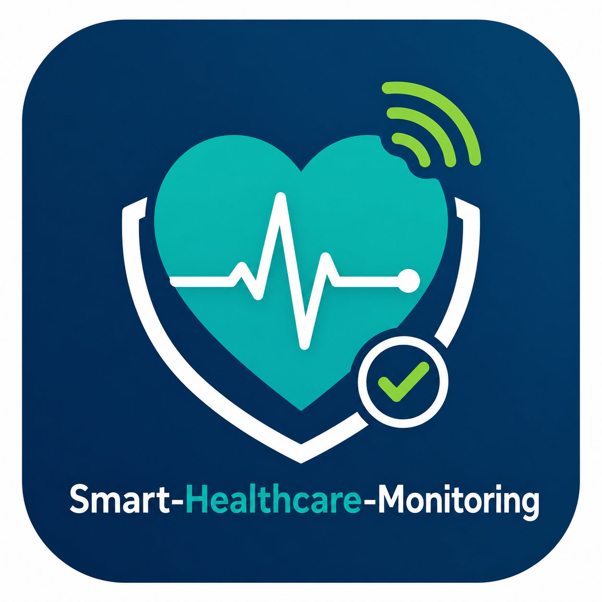

<div align="center">



# Smart Healthcare Monitoring

**IoT-powered real-time patient vitals monitoring — Progressive Web App**

[](https://smart-healthcare-monitoring.vercel.app/login)
[](https://react.dev)
[](https://www.typescriptlang.org)
[](https://vite.dev)
[](https://tailwindcss.com)
[](https://web.dev/progressive-web-apps)

🌐 **[https://smart-healthcare-monitoring.vercel.app](https://smart-healthcare-monitoring.vercel.app/login)**

</div>

---

## 📋 About

**Smart Healthcare Monitoring** is a production-ready Progressive Web App (PWA) built as an IoT Case Study for the Bachelor of Computer Applications program (Faculty of Computing & IT). It simulates a real-world hospital patient monitoring system where wearable IoT sensors (ESP32-based) stream live vitals to a cloud dashboard with real-time alerts.

| Field       | Detail                        |
|-------------|-------------------------------|
| Developer   | Aniket Tegginamath            |
| USN         | U23C01CA004                   |
| Course      | Internet of Things            |
| Assignment  | Assignment – I                |
| Topic       | Smart Healthcare Monitoring   |

---

## ✨ Features

### Role-Based Access
| Role | Access |
|------|--------|
| 🩺 **Doctor** | Full dashboard — all patients, vitals trends, ward analytics, pie chart, complete alert log |
| 🏥 **Nurse** | Alert-first dashboard — active alerts with quick acknowledge, patients needing attention |
| 👤 **Caregiver** | Simplified view — assigned patients only, large vitals, trend charts, contact doctor |

### Core Capabilities
- **Real-time vitals** — Heart Rate, SpO₂, Temperature, Blood Pressure, Respiratory Rate
- **IoT simulation** — 8 ESP32 nodes streaming data every 5 seconds with realistic drift
- **Threshold alerts** — auto-generated warnings & critical alerts when vitals breach safe limits
- **Live charts** — scrolling trend charts with warning reference lines (Recharts)
- **Patient management** — searchable, filterable patient list with device status
- **PWA** — installable on mobile & desktop, offline-capable via Workbox service worker
- **Responsive** — works on phone, tablet, and desktop

---

## 🏗️ IoT Architecture

```
┌─────────────────────────────────────────────────────┐
│                   Application Layer                  │
│      Doctor Dashboard · Nurse View · Caregiver App  │
└───────────────────────┬─────────────────────────────┘
                        │ REST / WebSocket
┌───────────────────────▼─────────────────────────────┐
│               Middleware / Cloud Layer               │
│       IoT Broker · Rules Engine · Alert Service      │
└───────────────────────┬─────────────────────────────┘
                        │ MQTT / HTTPS
┌───────────────────────▼─────────────────────────────┐
│                   Network Layer                      │
│            BLE · Wi-Fi · GSM / 4G / 5G              │
└───────────────────────┬─────────────────────────────┘
                        │
┌───────────────────────▼─────────────────────────────┐
│                   Device Layer                       │
│   ESP32 · Pulse Oximeter · Temp Sensor · ECG · IMU  │
└─────────────────────────────────────────────────────┘
```

---

## 🛠️ Tech Stack

| Layer | Technology |
|-------|-----------|
| Framework | React 19 + TypeScript |
| Build Tool | Vite 8 (Rolldown) |
| Styling | Tailwind CSS v4 |
| State Management | Zustand 5 |
| Charts | Recharts 3 |
| Routing | React Router v7 |
| PWA | vite-plugin-pwa + Workbox |
| Icons | Lucide React |
| Deployment | Vercel |

---

## 📁 Project Structure

```
shm-pwa/
├── public/
│   ├── logo.png                  # App logo / favicon
│   └── icons/                    # PWA icons
├── src/
│   ├── assets/
│   │   └── logo.png
│   ├── components/
│   │   ├── common/               # StatusBadge, Footer
│   │   ├── dashboard/
│   │   │   ├── roles/            # DoctorDashboard, NurseDashboard, CaregiverDashboard
│   │   │   ├── VitalCard.tsx     # Individual vital display card
│   │   │   └── VitalsChart.tsx   # Recharts trend chart
│   │   ├── layout/               # AppLayout, sidebar, header
│   │   └── patients/             # PatientRow
│   ├── pages/
│   │   ├── Login.tsx             # Role selection screen
│   │   ├── Dashboard.tsx         # Role-aware dashboard router
│   │   ├── Patients.tsx          # Searchable patient list
│   │   ├── PatientDetail.tsx     # Full vitals + 5 charts + history
│   │   ├── Alerts.tsx            # Alert centre
│   │   └── Settings.tsx          # Thresholds, profile, IoT config
│   ├── services/
│   │   └── vitalsSimulator.ts    # ESP32 IoT data simulator
│   ├── store/
│   │   ├── authStore.ts          # Zustand auth (role-based)
│   │   ├── patientsStore.ts      # Live vitals + history
│   │   └── alertsStore.ts        # Alert generation & management
│   ├── types/index.ts            # TypeScript interfaces
│   └── utils/
│       ├── thresholds.ts         # Clinical alert thresholds
│       └── formatters.ts         # Time / date helpers
├── .npmrc                        # legacy-peer-deps for Vercel
├── vite.config.ts                # Vite + PWA config
└── index.html
```

---

## 🚨 Vital Sign Thresholds

| Vital | Warning Range | Critical Range |
|-------|--------------|----------------|
| Heart Rate | 50 – 100 bpm | < 40 or > 130 bpm |
| SpO₂ | < 94% | < 90% |
| Temperature | 36.0 – 37.5 °C | < 35.0 or > 39.5 °C |
| Blood Pressure (Sys) | 90 – 140 mmHg | < 70 or > 180 mmHg |
| Respiratory Rate | 12 – 20 br/min | < 8 or > 30 br/min |

---

## 🚀 Getting Started

```bash
# Clone the repo
git clone https://github.com/Aniket886/Smart-Healthcare-Monitoring.git
cd Smart-Healthcare-Monitoring

# Install dependencies
npm install

# Start dev server
npm run dev

# Production build
npm run build
```

Open [http://localhost:5173](http://localhost:5173) and select a role to log in.

---

## 📱 PWA Installation

On supported browsers, click the **Install** button in the address bar (desktop) or **Add to Home Screen** (mobile) to install as a standalone app with offline support.

---

## 📚 References

1. World Health Organization — [Global strategy on digital health 2020–2025](https://www.who.int/publications/i/item/9789240020924)
2. NIST — [IoT Device Cybersecurity Capability Core Baseline](https://csrc.nist.gov/pubs/ir/8259/a/final)
3. OASIS — [MQTT Version 5.0 Standard](https://docs.oasis-open.org/mqtt/mqtt/v5.0/mqtt-v5.0.html)
4. HL7 International — [FHIR RESTful API, Release 4](https://www.hl7.org/fhir/r4/http.html)
5. HHS — [Telehealth & Remote Patient Monitoring Best Practice Guide](https://telehealth.hhs.gov/providers/best-practice-guides/telehealth-and-remote-patient-monitoring)

---

<div align="center">

Made with ❤️ by **Aniket Tegginamath** · USN: U23C01CA004

Faculty of Computing & IT · Bachelor of Computer Applications

</div>
